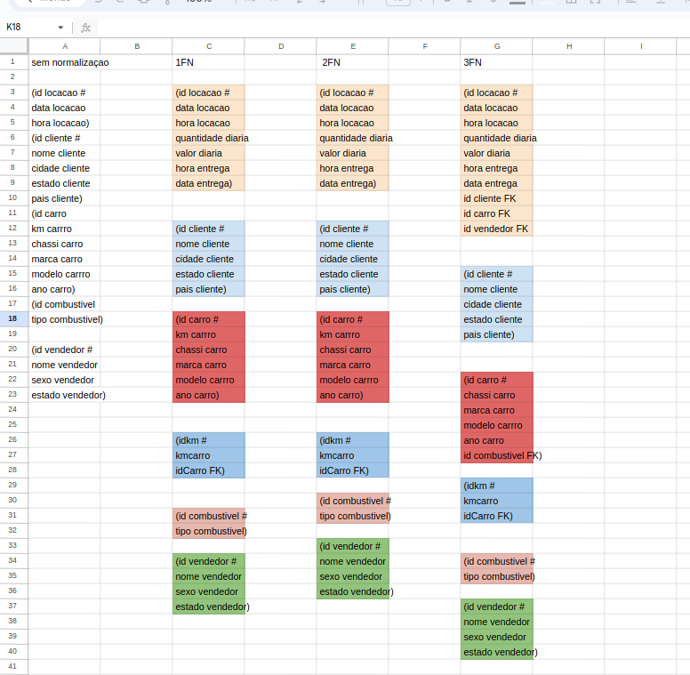
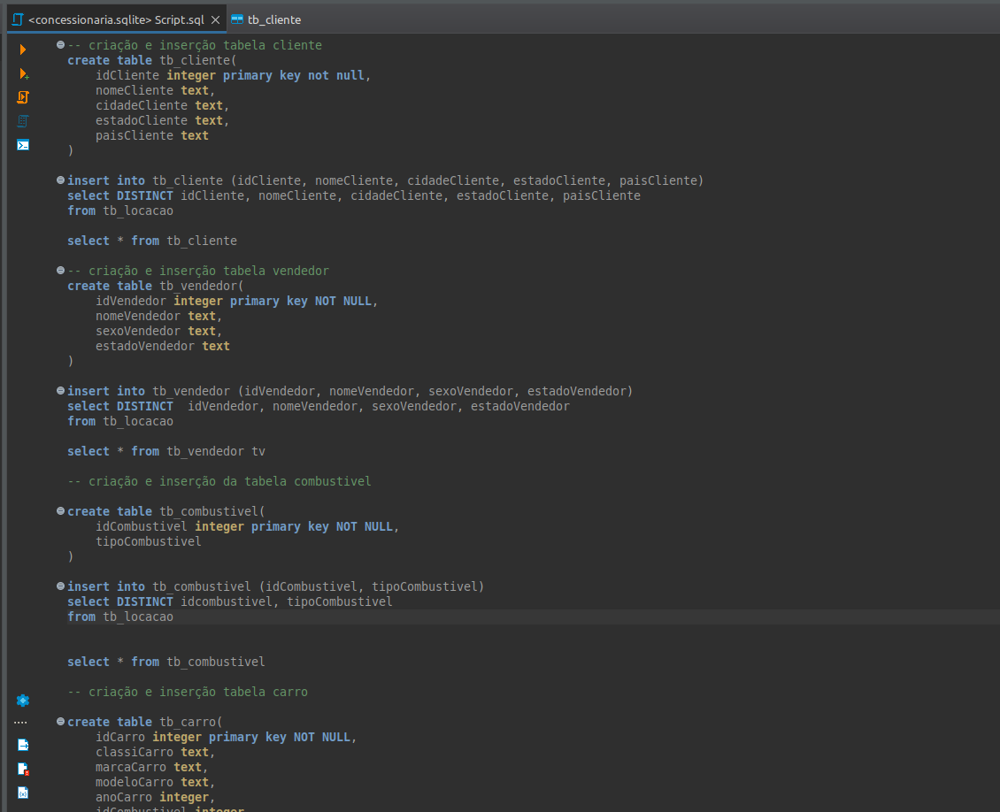
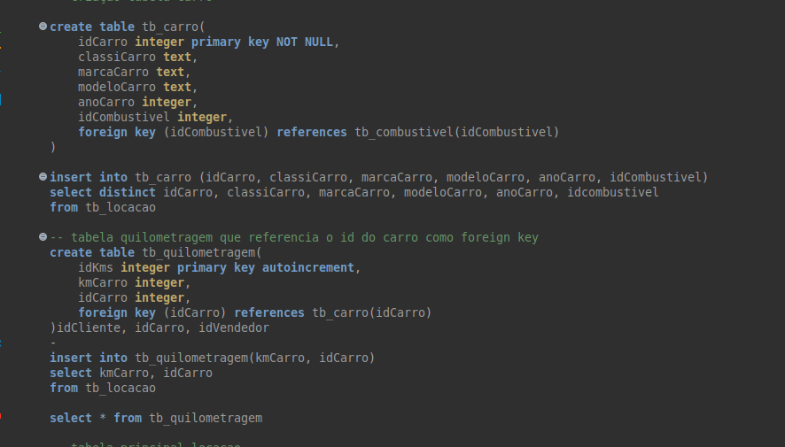
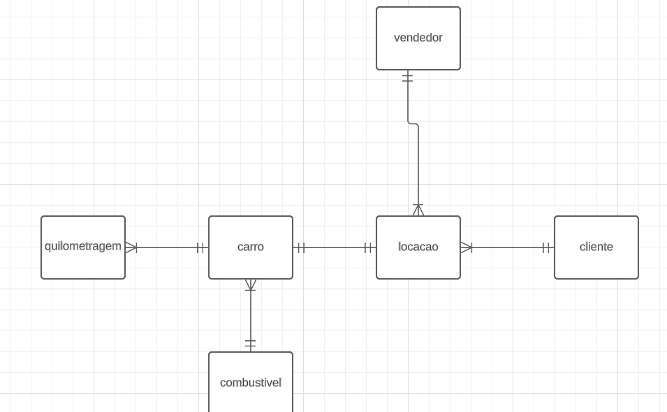
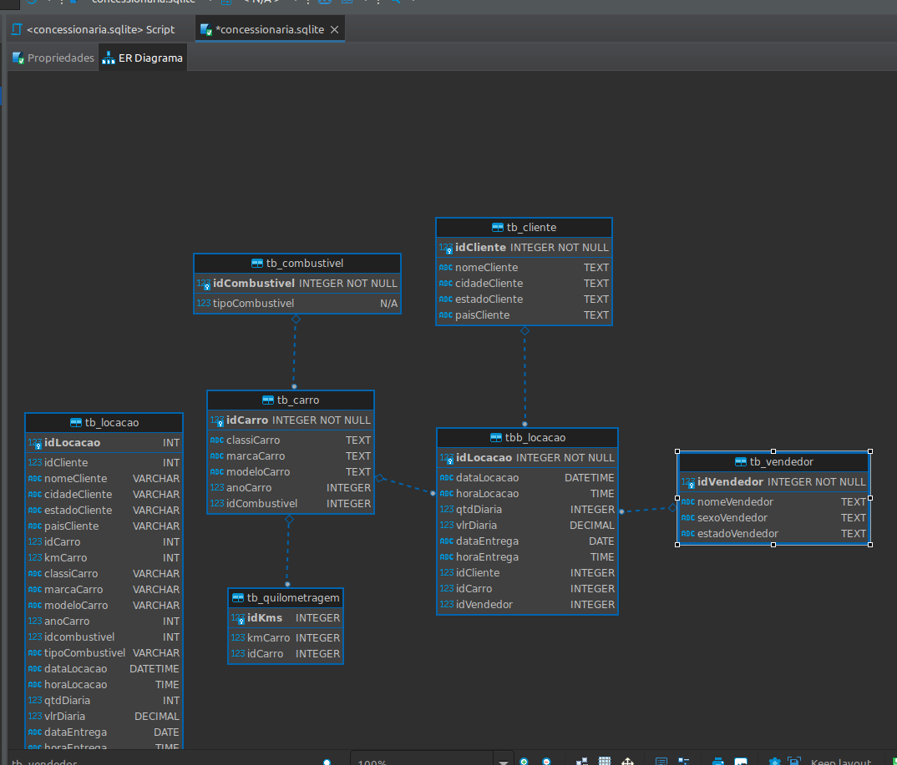
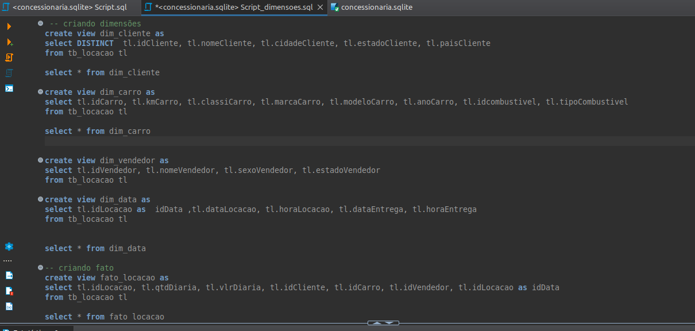
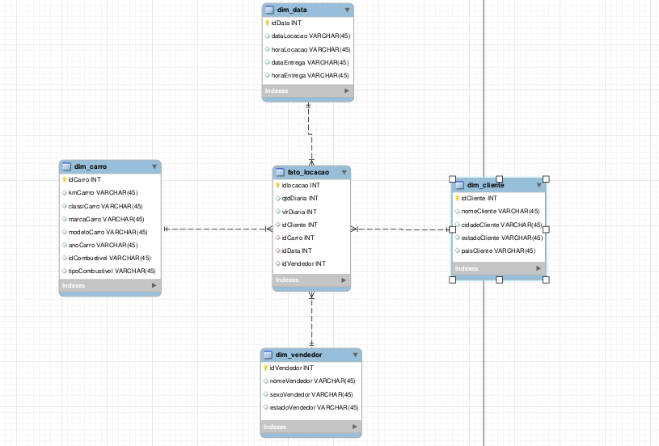

# Modelo relacional e dimensional

## Normalização modelo relacional
    Primeiramente para entender oque eu tinha que fazer nas 3 formas eu coloquei elas em uma planilha para ir comparando:
 
 

    Na planilha em questão eu não apliquei os conceitos na ordem correta, pois eu não tinha visto nenhum campo multivalorado como telefone, ou composto como endereço. Portanto desde o começo eu já fiz a segunda forma que era separar tabelas para que dependessem de uma chave primária apenas e que essa chave tenha correlação com suas colunas como 'nomecliente' e 'cidadecliente' fazem parte de 'idCliente'. Finalmente na terceira forma eu me certifiquei que colunas não chaves não dependessem de colunas que também não fossem chaves primárias, então para resolver isso eu sabia que campos como 'cliente', 'carro' e 'vendedor' deveriam ter relação com 'locação', mas como cada um desses campos tem muitos atributos específicos, eu criei uma tabela para cada um e deixei o id deles como chave estrangeira na tabela principal.

### Modelo físico

    
    Aqui basicamente peguei as tabelas finais na 3FN e criei todas com campos vazios e depois eu inseria os dados com a consulta na tabela principal:

 

    esses foram apenas alguns prints, mas o script está todo na pasta onde se encontra esse readme.md.
### Modelo Lógico
    Essa é uma explicação das relações no modelo lógico:
- Vendedor/Locação
    - Um vendedor pode vender muitas locações: 1 para N
    - Uma locação só pode ser vendida por um vendedor por vez: 1 para 1
- Carro/Locação
    - Um carro só pode ter uma locação por vez: 1 para 1
    - Um processo de locação só pode ter um carro: 1 para 1
- Carro/Quilometragem
    - Um carro pode ter muitas quilometragens em períodos diferentes: 1 para N
    - Uma quilometragem só pode estar em um carro: 1 para 1
- Carro/Combustível
    - Um carro só pode ter um tipo de combustível: 1 para 1
    - Um tipo de combustível pode estar em diferentes carros: 1 para N
- Cliente/Locação
    - Um cliente pode fazer várias locações: 1 para N
    - Uma locação só pode ser feita por um cliente por vez: 1 para 1

## Modelagem dimensional
    Na etapa de transformar o modelo relacional para dimensões eu segui os passos visando que a tabela fato é normalizada, porém as dimensões podem ou não ser normalizadas, para que as consultas sejam facilitadas, então ignorei algumas mudanças como criar uma tabela específica para combustivel.

 

 

- modelo estrela
    
      A maior das mudanças que eu fiz foi criar uma tabela apenas para as datas da locação, pois na regra da modelagem dimensional, a tabela fato deve conter apenas dados quantitativos ou qualitativos, datas devem ficar em dimensões e serem ligadas na tabela fato assim como todas as outras dimensões.
